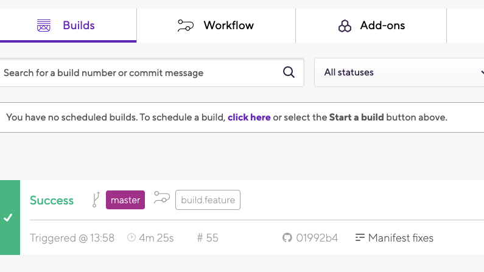
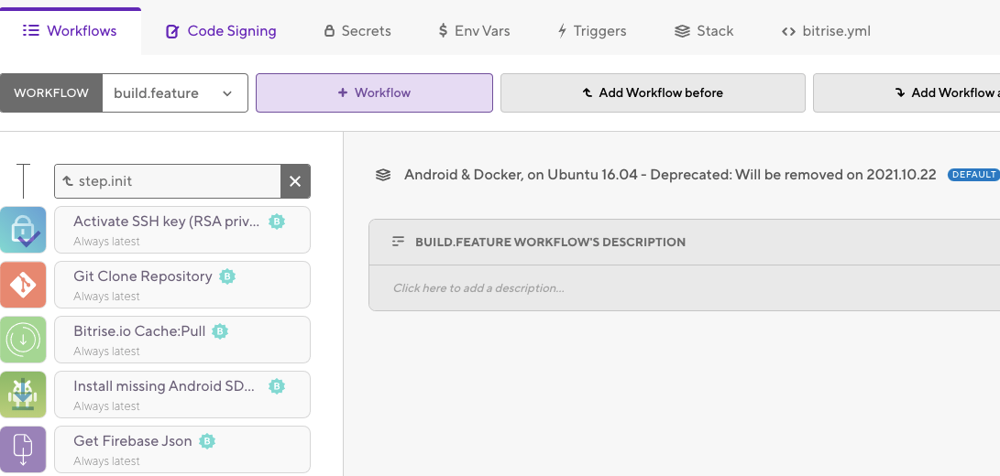

Easy to use CI/CD Image for Android builds

<!-- end -->

#What is it


A maintained Android Image for CI pipelines. Can be used for any CICD that uses Docker hub, works with standard Android or Fastlane. Use the image as is or pull the code yourself and make it work for your specific needs.

##Latest version
image: ijhdev/gitlab-ci-fastlane-android

#How to use it


##Example Gitlab .Yaml

```
image: ijhdev/gitlab-ci-fastlane-android

variables:
 ANDROID_COMPILE_SDK: "31"
 ANDROID_BUILD_TOOLS: "30.0.3"
 ANDROID_SDK_TOOLS:   "7583922"
 LC_ALL: "en_US.UTF-8"
 LANG: "en_US.UTF-8"
 GIT_STRATEGY: clone

before_script:
 - export GRADLE_USER_HOME=$(pwd)/.gradle
 - chmod +x ./gradlew

cache:
 key: ${CI_PROJECT_ID}
 paths:
   - .gradle/

stages:
 - unit_test
 - debug_build

unit_test:
 tags:
   - your_build_runner
 dependencies: []
 stage: unit_test
 artifacts:
   paths:
     - fastlane/screenshots
     - fastlane/logs
   expire_in: 1 hour
 script:
   - fastlane tests

debug_build:
 tags:
   - your_build_runner
 dependencies: []
 stage: debug_build
 artifacts:
   paths:
     - app/build/outputs/
   expire_in: 1 week
 script:
   - bash ./version_updater.sh
   - fastlane yourDebug
```

##Example Bitrise

Open up bitrise and the project you want to change the image for


From here click on Workflow



Once in Workflow navigate to Stack


Here you will see default Stack and Workflow Specific Stasks. If you want to change the build image for all steps then use default but if there is just one area failing for you then use the Workflow specific stacks

#But wait


Also included in the Github codebase is an Android auto version updater. The version updater takes your Google Play store listing and checks it against your Gradle version. If your Gradle version number is higher than the app store it will stick with it, if it's equal or lower that the store version then it will take that, +1 to the end, then change the Gradle version for that one.

All you need to do is take the version_updater.sh file from the Github and put it in the root folder of your app and edit this line to have your bundle ID

```
curl -O playstorepage https://play.google.com/store/apps/details\?id\=<YourBundleID>
```

#Check out the Image and Code here


https://hub.docker.com/repository/docker/ijhdev/gitlab-ci-fastlane-android/general

https://github.com/seperot/Android_Fastlane_CICD_Image
