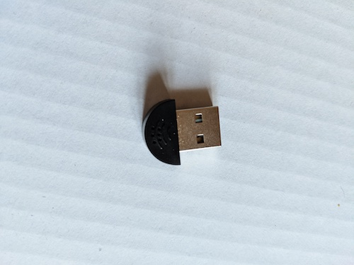
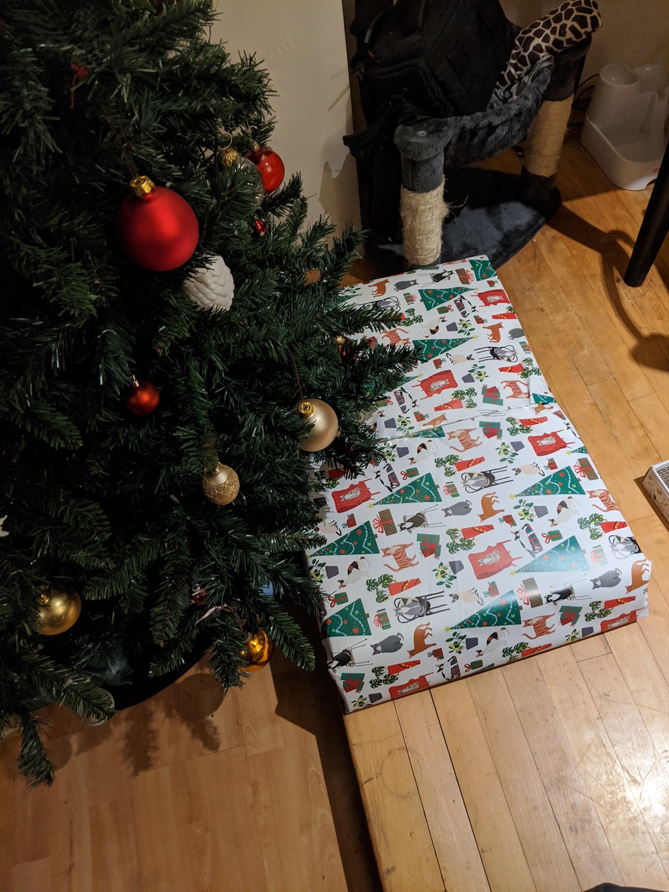

A smart mirror with google assistant makes for a cool gift
<!-- end -->

So for Christmas this year I made a smart mirror as a gift. I wanted something that was functional as a mirror but also cool and with handy extras like USB charge ports and music.

###Things you will need

* __*A screen:*__ I pulled the one I am working with from an old Samsung laptop. You can find controller units on Amazon or Ebay that turn it into standard monitor with ports and controls. Or you can take out the screen from any monitor really.

* __*A raspberry Pi:*__ Pretty standard, the one in this build is a Raspberry Pi 3 Model B+ but I think you can get away with older models, just don't select a Raspberry Pi Zero as it's not got enough power to run everything

* __*A Speaker:*__ If your going to use things like Google assistant and may play music from it you need to have at least a passable speaker connected.

* __*A Microphone:*__ You can go for a cheap option here, So long as the google assistant can hear what your saying then it's fine

* __*A USB Hub:*__ This helps power your Pi and Speakers so you won't need a million cables coming out the back of the mirror

* __*A Mirror:*__ The mirror I'm working with is a dressing table mirror but you can use just about anything.

* __*Tools and Materials to put it together:*__ For this build I used wood to build a backing area where I could place everything nicely but you can do whatever is best for your setup

* __*Cables to connect everything together:*__ HDMI Cable, USB to micro usb cables, male to male audio cable, power cable for the monitor all needed.

###Setting up the Pie

[We will be using MagicMirror²](https://github.com/MichMich/MagicMirror) for this build
https://github.com/MichMich/MagicMirror/wiki/Auto-Starting-MagicMirror
[For music we can use Raspotify](https://github.com/dtcooper/raspotify) for music
HDMI boost config
https://github.com/dtcooper/raspotify/issues/174

Installation

3rd part plugins
Google assistant setup

###Assembling

###It's working

