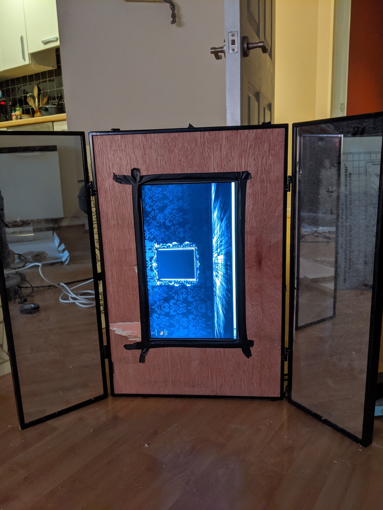

A smart mirror build with spotify added in
<!-- end -->

So for a challenge, I wanted to try and make a Smart Mirror. I wanted to make it functional as a mirror but also cool and with handy extras like USB charge ports and music.

###Things needed

* __*A screen:*__ I pulled the one I am working with from an old Samsung laptop. You can find controller units on Amazon or Ebay that turn it into standard monitor with ports and controls. Or you can take out the screen from any monitor really.

* __*A raspberry Pi:*__ Pretty standard, the one in this build is a Raspberry Pi 3 Model B+ but I think you can get away with older models, just don't select a Raspberry Pi Zero as it's not got enough power to run everything.

* __*A Speaker:*__ If your going to play music from it you need to have at least a passable speaker connected.

* __*A USB Hub:*__ This helps power your Pi and Speakers so you won't need a million cables coming out the back of the mirror.

* __*A Mirror:*__ The mirror I'm working with is a dressing table mirror but you can use just about anything.

* __*Tools and Materials to put it together:*__ For this build I used wood to build a backing area where I could place everything nicely but you can do whatever is best for your setup. For the front I got a 2 way plastic mirror on Amazon that was close enough to the right size it just needed a bit of a trim on the edges

* __*Cables to connect everything together:*__ HDMI Cable, USB to micro usb cables, male to male audio cable, power cable for the monitor all needed.

###Setting up the Pie

[We will be using MagicMirror²](https://github.com/MichMich/MagicMirror) for this build, make sure to read up on how to auto start the mirror too [here.](https://github.com/MichMich/MagicMirror/wiki/Auto-Starting-MagicMirror) 

Initially, I had planned on using Google assistant but as the build started Google deprecated the usage so instead to make sure we can have
[music we can use Raspotify](https://github.com/dtcooper/raspotify) for music, this had a bit of an issue with the HDMI so make sure you check out this if you have the same problem [HDMI boost config](https://github.com/dtcooper/raspotify/issues/174)

Honestly once they are working it was smooth sailing!

###Installation

First I made sure the screen fit into the wood I had cut out. Made sure to use tape to seal any extra light from things like the pie showing up mirror side.

Also useful for securing it in place

Next I made sure everything was going to fit and cut holes for all the items to be accessible from the back

Finally I turned it all on without the new glass in to make sure it was working.

###All Done

