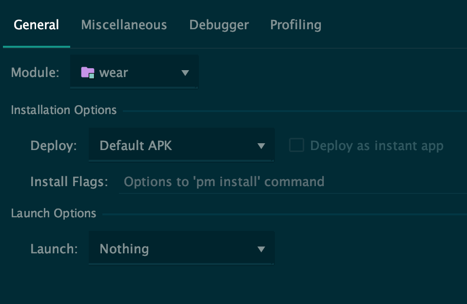

Making a wearOS watch face shouldn't be this much of a faff Google! (TurtleWare 2.0 pt2)
<!-- end -->

This is part 2 of a 3 part blog post about making v2 of turtle wear watch face. [You can check out part 1 here](https://ijh.dev/middlewear-go)

###Starting the project off


Starting off, WearOS is the same as Android for 99% of things. Meaning you can write this in Kotlin (or Java if you love some boilerplate) and use all the same Android libraries. So for folder structures and initializing the project can be done in Android Studio just like you would a phone app. For Turtle Wear 2.0, there are two important entry points. The CanvasWatchFaceService and the MainActivity.

####CanvasWatchFaceService
The CanvasWatchFaceService is the place where you run all the watch face visuals. You set an inner class that contains a CanvasWatchFaceService.Engine() which deals with refresh speeds, ambient and active visuals, and custom tap commands. The CanvasWatchFaceService is pretty standard and should look something like the below:

```java
class TurtleFace : CanvasWatchFaceService() {

  var specW: Int = 0
  var specH: Int = 0
  private val displaySize = Point()

  companion object {
    private const val INTERACTIVE_UPDATE_RATE_MS = 1000
    private const val MSG_UPDATE_TIME = 0
  }

  override fun onCreateEngine(): Engine {
    return Engine()
  }

  private class EngineHandler(reference: Engine) : Handler() {
    private val mWeakReference: WeakReference<Engine> = WeakReference(reference)

    override fun handleMessage(msg: Message) {
      val engine = mWeakReference.get()
      if (engine != null) {
        when (msg.what) {
          MSG_UPDATE_TIME -> engine.handleUpdateTimeMessage()
        }
      }
    }
  }
```

The inner class Engine has a lot more moving parts but some bits to consider are:

* __Standard Android lifecycle events__ - So you can deal with the watch face starting, going into the background and being stopped when changed
* __onAmbientModeChanged__ - This is where you can control what you show and hide when the user is actively looking at the watch or not.
* __onTapCommand__ - This controls any custom action you want your watch face to perform, like a double tap to refresh the view
* __onDraw__ - The main visuals for your view go here rather than OnCreate
* __onApplyWindowInsets__ - This helps with different screen sizes (Round, flat tire, square) so your watch face fits all of them

####MainActivity
This should be familiar to anyone who has made an Android app, this is where your android.intent.action.MAIN and android.intent.category.LAUNCHER is set to on the manifest. In this case, it will be the launch point for the settings app.

###Setting up the simulator


There are a few catches with working on wearOS apps, especially with a watch face. The first being the standard configuration. This will always finish building with the settings app open, which if you are working on watch face changes is a bit annoying. It’s better to have this as the configuration settings.



This way the app will build but nothing will change on the device or simulator. Next is setting up devices to debug the build on. I’ll break down both options:

####Simulator
Open up the Android Virtual Device Manager for this and select create a new virtual device at the bottom. Choose a WearOS as your hardware, Select Pie as the system image but don’t select the Chinese version unless you specifically want that, everything else is fine on default so you can click finish.

####Device
For this method, you should have an Android phone or tablet connected to your workstation already. Make sure it got developer settings enabled and has allowed your workstation access. You will also need the Wear OS app installed on that device and bluetooth connected to the wearable.

Open the WearOS app on the Android device and scroll to the bottom where advanced settings are, at the bottom here is “Debugging over Bluetooth”. Turn that on and you should get “Host: Disconnected Target: Connected”. Once that’s done go into terminal and enter the following commands:

```bash
adb forward tcp:4444 localabstract:/adb-hub
adb connect 127.0.0.1:4444
```

Now your wearable should be connected and ready to use

###Manifest settings


With making a wearable app and specifically a watch face there are some permissions you need to have set in the manifest they are:

#####Required for any of this to work on a wearable
```xml
<uses-feature android:name="android.hardware.type.watch" />
```
#####Required to act as a custom watch face
```xml
<uses-permission android:name="android.permission.WAKE_LOCK" />
```
#####Required for complications to receive complication data and open the provider chooser
```xml
<uses-permission 
android:name="com.google.android.wearable.permission.RECEIVE_COMPLICATION_DATA"
/>
```

Next one and another set most apps will likely need is internet access, you will likely also need Bluetooth access if you want to communicate with the connected device
```xml
<uses-permission android:name="android.permission.INTERNET" />
<uses-permission android:name="android.permission.BLUETOOTH" />
<uses-permission android:name="android.permission.ACCESS_NETWORK_STATE" />
<uses-permission android:name="android.permission.FOREGROUND_SERVICE" />
```

Slightly less important is location services, Turtle wear needs this information to get weather data for your location
```xml
<uses-permission android:name="android.permission.ACCESS_COARSE_LOCATION" />
<uses-permission android:name="android.permission.ACCESS_FINE_LOCATION" />
```

For our CanvasWatchFaceService, we need to declare it specifically as a watch face. So we start by flagging it as a service and giving it a specific Bind Wallpaper permission

```xml
<service
android:name=".watchface"
android:label="@string/my_name"
android:permission="android.permission.BIND_WALLPAPER">
```

Next, we set up the metadata for the watch face and what the watch face example screen will look like on a square and circular screen type. The examples are used when the user selects the watch face from the selection screen

```xml
<meta-data
android:name="android.service.wallpaper"
android:resource="@xml/watch_face" />
<meta-data
android:name="com.google.android.wearable.watchface.preview"
android:resource="@drawable/preview_digital" />
<meta-data
android:name="com.google.android.wearable.watchface.preview_circular"
android:resource="@drawable/preview_digital_circular" />
```

The last part is identifying it as a watch face

```xml
<intent-filter>
<action android:name="android.service.wallpaper.WallpaperService" />
<category 
android:name="com.google.android.wearable.watchface.category.WATCH_FACE" 
/>
</intent-filter>
</service>
```

The main activity manifest setup is thankfully very default android.

```xml
<activity
android:label="@string/app_name"
android:name=".MainActivity">
<intent-filter>
<action android:name="android.intent.action.MAIN"/>
<action android:name="android.intent.action.VIEW"/>
<category android:name="android.intent.category.LAUNCHER"/>
</intent-filter>
</activity>
```

##Important
Without this inside the application area of the manifest, you will not be able to make any API calls out from the phone on newer devices. The error messaging on this is vague so it took ages for me to find this.
```xml
android:usesCleartextTraffic="true”
```

###Drawing the watch face


If you check most places for how to draw the watch face, you will generally see very large OnDraw functions that require canvas drawing. I instead prefer to use xml layouts in the same way you would with an android application. This is a little less efficient but a lot more readable code in my opinion. To set this up first have a lateinit View outside the engine. Then on the OnCreate you inflate it like this:

```java
val inflater: LayoutInflater = 
getSystemService(Context.LAYOUT_INFLATER_SERVICE) as LayoutInflater
watchLayout = inflater.inflate(R.layout.watchface, null)
```

With the view now inflated, you can set it up with the screen dimensions on the OnDraw like below

```java
watchLayout.measure(specW, specH)
watchLayout.layout(0, 0, watchLayout.measuredWidth, watchLayout.measuredHeight)
canvas.save()
canvas.translate(mXOffset, mYOffset - 40)
watchLayout.draw(canvas)
canvas.restore()
```

With that done, you now call any element you need to update wherever you need. For example, this is called on the OnDraw elsewhere for showing the current time.

```java
private fun setTimeandDate() {
      val now = System.currentTimeMillis()
      mCalendar.timeInMillis = now
      val date: TextView = watchLayout.findViewById(R.id.date_number)
      date.text = String.format("%02d/%02d", 
      mCalendar.get(Calendar.DAY_OF_MONTH), 
      mCalendar.get(Calendar.MONTH) + 1)
      val hour: TextView = watchLayout.findViewById(R.id.hourtime)
      hour.text = String.format("%02d", mCalendar.get(Calendar.HOUR_OF_DAY))
      val min: TextView = watchLayout.findViewById(R.id.mintime)
      min.text = String.format("%02d", mCalendar.get(Calendar.MINUTE))
    }
```

###Finishing it up and launching

Link to CI/CD mobile blog