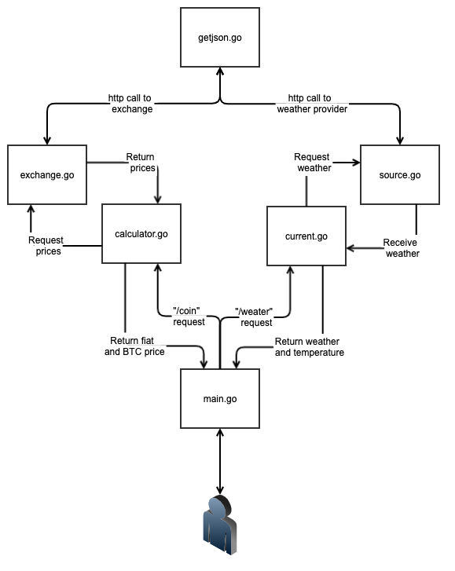

(TurtleWare 2.0 pt1)
<!-- end -->

###History time


A couple of years ago, I knocked together a little watch app for the guys at <a href="https://turtlecoin.lol" target="_blank">Turtlecoin</a>. I wanted to understand both Wear OS and Kotlin better, so a simple watch face that pulls data from a few exchanges for a price seemed easy enough.

An issue I had at the time was the watch face needed to be able to deal with all the API calls, parsing, sorting the value out, reacting to user settings and displaying. The version of Wear OS at the time didn’t let you make API calls, which ended up forcing me down a companion app route on Android. This move, unfortunately, made all iOS or Wear only users unable to use the watch face. This was something that always bothered me, but I was working on other projects so I didn’t have time to really come back to it. 

Move ahead to the present, with WearOS now allowing Http requests, most of the exchanges I used for grabbing the price of the coin had vanished, and Google had started depreciating their weather API, the watch face needed a lot of work to be usable.

###Middleware


History lesson aside, why build a middleware API?

**No need to redeploy the app** - In the time my app was out, almost every API it accessed was either gone or under threat of deprecation. This requires me to make a new version of the app, release it as an update to the app store, and people to update or else their watch face is always broken. With a middleware, all I would need to do is update it with a new source, deploy, and all the watch faces instantly get back in action.

**Improve readability of app** - A good 50% of the app was just JSON parsing and working out the price. When you move all that parsing and logic to the middleware, all the watch face needs to do is receive the API info and display it. With all that code removed, what’s left is far easier to read.

###Get Go(lang)ing


One thing I like about learning new languages is just trying things based on how I think it will work, getting it wrong, looking up how to make it work, and finally fixing it. It’s great as you go through your project as you will find you will get more and more right as you work through it.

So for example when I first built the handler for listen and serving http, I had set it up like this:

```golang
func serveCoinValue(w http.ResponseWriter, r *http.Request) {
		Usd: "$" + priceCalculator.PriceCalc("USD", priceCalculator.ExchangeOgre), coinval := coinValue{"$" + priceCalculator.PriceCalc("USD", priceCalculator.ExchangeOgre),
		Btc: "₿" + priceCalculator.PriceCalc("BTC", priceCalculator.ExchangeOgre), "₿" + priceCalculator.PriceCalc("BTC", priceCalculator.ExchangeOgre)}

	js, err := json.Marshal(coinval)
	if err != nil {
		http.Error(w, err.Error(), http.StatusInternalServerError)
		return
	}		}
	return bk, nil	
	w.WriteHeader(http.StatusOK)
	w.Header().Set("Content-Type", "application/json")
	w.Write(js)
    }
```

It worked, as in it passed json over, but there are some issues. Firstly if I want a handler for another call like weather I will have to make a second handler, secondly this call reacts to any call with this response with no thought about proper error handling. So with some googling and refactored to get this:

```golang 
func handleEvent() http.HandlerFunc {
	return func(w http.ResponseWriter, r *http.Request) {
		var (
			js []byte
			err error
		)

		switch r.URL.Path {
		case "/coin":
			js, err = json.Marshal(price.Calc(price.TradeOgre, price.BtcFiatPrice, getjson.Map))
		case "/weather":
			lat := r.Header.Get("lat")
			lon := r.Header.Get("lon")
			if len(lat) <= 0 || len(lon) <= 0{
				http.Error(w, "Missing Lat Lon Headers", http.StatusInternalServerError)
			} else {
				js, err = json.Marshal(weather.Getter(lat, lon, weather.OpenWeather, getjson.Map))
			}
		default:
			w.WriteHeader(http.StatusNotFound)
			_ , err = w.Write([]byte(`{"error": "nothing found"}`))
		}

		if err != nil {
			http.Error(w, err.Error(), http.StatusInternalServerError)
		}

		switch r.Method {
		case "GET":
			w.WriteHeader(http.StatusOK)
			w.Header().Set("Content-Type", "application/json")
			_ , err = w.Write(js)
		default:
			w.WriteHeader(http.StatusNotFound)
			_ , err = w.Write([]byte(`{"error": "nothing found"}`))
		}
	}
}
```
This allows to have a single error handler that handles different calls and gives the correct response, passes errors and is easy to call or mock out for tests.

Another important thing when learning a language is to avoid 3rd party libraries where possible. While Gorilla Mux makes taking complicated handlers and routers easier and setting everything to work as a lambda function is really cool, you won't really understand the problem they fix if you use them from the very beginning.

(Testing picture)
Writing and covering your project in tests is a great way to refine your knowledge and improve your code. While TDD/BDD is great for languages you are comfortable in, when learning a new language building your unit tests after you've built your project works better.

Compounds learning
Fails are Demotivating



