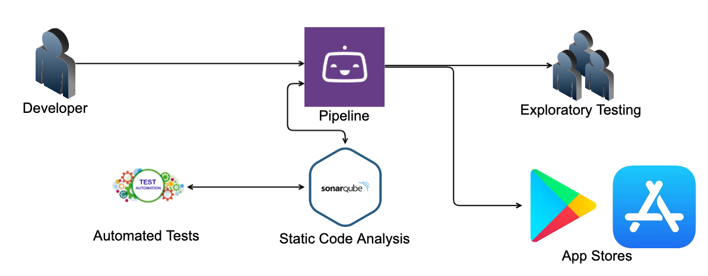

A guide on minimizing faff and getting a scalable team moving faster
<!-- end -->

##What is CI/CD?
CI/CD stands for continuous integration / continuous delivery. The CI part is the goal of having code automatically built into an application to allow engineers to commit code more frequently and react faster to any issues. The CD part is built applications being available to different environments, automated testing and eventually deployment to the app stores. Both parts work together when you work with a pipeline, have good code coverage and a easy to follow process for everyone that isn't time consuming.

CI/CD works best when you have a team of engineers working on a product together, but don't need to be living in each others pockets knowing what they are working on. The "Squad" model is a good example of what I mean here. Utilizing small, fast, incremental changes will mean no one is getting stuck behind a massive pull request or finding out their code is conflicting with someone elses 2 weeks later.

##Buiding a pipeline with Bitrise
There are a number of good pipeline CI/CD tools out there today. Bitbucket and Azure dev ops have built in solutions, Jenkins, Team City and Circle CI are are great stand alone options with good integrations with most languages and systems. As the title of this is focusing on mobile development, I will be using Bitrise. Bitrise is a mobile app centric 

##Static code analysis with Sonarqube

##Unit & UI automated tests

##Getting past a git flow mentality
One of the first parts I had to deal with when moving to a CI/CD world is git. Most people are aware of git flow and much like that "truly agile" company you always get told about, they only do it half right. However, to get the best out of CI/CD it's better to throw git flow out completely and adopt <a href="https://trunkbaseddevelopment.com/" target="_blank">trunk based development.</a> This, is almost guaranteed to have someone worried:
> But what if someone pushes broken code up?

Well, if this is something you think your engineers will be doing often, you need to evaluate your hiring policies and interview criteria. 

Seriously though, making pull requests mandatory on your Trunk branch is an easy way to help this process. Later on you will be hooking in a pipeline that will automatically build and run tests on the code that can pass or fail the PR on it's own as well as static code analysis to really lock down any issue of a mistaken crash getting in.

> How will I know what's going into the codebase?

Another reason for Pull Requests but with the added need for concise commit messages and squashed commits. This allows a nice clean timeline on your trunk branch for any dev to read.

> But how will we know when it's time to release?

> Won't we get held up if we have to wait for code to be released with only one branch?

##Intergrating with project managment tools

##Summary