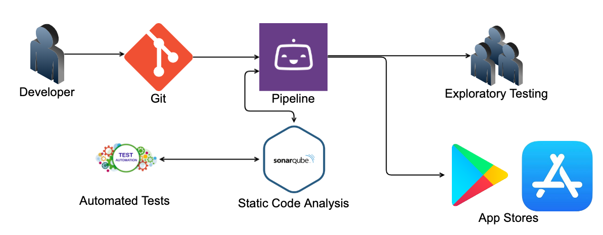

A guide on minimizing faff and getting a scalable team moving faster
<!-- end -->

###Caveats and Preamble
Before you start on this path, there are a few assumptions have been made, mostly for the sake of not explaining everything. It is assumed you are comfortable with Git, Unit and UI testing, and have admin rights to any systems to want to integrating into. Also don't take this as by the letter solution, use it as a way to try things out and explore options not mentioned.

##What is CI/CD?
CI/CD stands for continuous integration / continuous delivery. The CI part is the goal of having code automatically built into an application to allow engineers to commit code more frequently and react faster to any issues. The CD part is built applications being available to different environments, automated testing and eventually deployment to the app stores. Both parts work together when you work with a pipeline, have good code coverage and a easy to follow process for everyone that isn't time consuming.

CI/CD works best when you have a team of engineers working on a product together, but don't need to be living in each others pockets knowing what they are working on, it also works well for a single developer trying to save precious time wasted on repetitive tasks outside of improving their app. The <a href="https://medium.com/productmanagement101/spotify-squad-framework-part-i-8f74bcfcd761" target="_blank">squad</a> model is a good example of what I mean here. Utilizing small, fast, incremental changes will mean no one is getting stuck behind a massive pull request or finding out their code is conflicting with someone elses 2 weeks later.

##Building a pipeline with Bitrise
The first step towards a CI/CD workflow is getting a automated pipeline. This will listen out for certain triggers and fire a series of automated tasks out from it. There are a number of good pipeline CI/CD tools out there today. Bitbucket and Azure dev ops have built in solutions, Jenkins, Team City and Circle CI are are great stand alone options with good integrations with most languages and systems. As this is focusing on mobile development, We will be using <a href="https://www.bitrise.io" target="_blank">Bitrise.</a> 

Bitrise offers a Hobby tier which is free to use. Their limits on build times in this band are a quite lean but work if you are investigating it or just starting out a project and don't have a lot of code down yet, other than that you have the exact same tools available to you as an larger company using the service. Once signed up you can hook your git repository of choice in with it's step by step starting guide, at the end of that it will spit you out an app dashboard with a test build running and you on the builds tab. 

From here, click on the settings tab first, review all the options in here including that your build number, default branch, app name & SSH is all correct. I would also recommend turning on Enable rolling builds here, it will help if your firing a lot of builds off quickly so you don't end up with a giant queue of builds that don't need to be built anymore. Next, check over the code tab and configure a web hook to your git repository, this is important as this the link bitrise needs to listen for branch changes. Once that's sorted head into the workflow tab.

Here you will have several tabs based on your app type, the important ones to cover here are Workflows, Env Vars, and Triggers the rest are situational and are mostly not needed right now. Starting with Workflows, this is the main area of bitrise and where you will be spending most of your time when building and improving your pipeline. Using the mindset of having reusable components I found the best way to structure Bitrise's workflows is the following:

####Step
This is the inner part of every workflow, some ones pre setup that are useful are Activate SSH key, Git Clone Repository and Bitrise.io Cache:Pull. If you click the + symbols in between the steps you can grab from a library of pre-made steps that you just need to configure and use.

####Workflow step
This is your a workflow that does a single purpose. So lets say you wanted to have a step that runs your Unit tests, you would make a workflow called STEP-UNIT-TEST, and inside you would grab all the steps you need to complete that task and configure them.

####Workflow build
This is what you call with your triggers. For example, if you wanted to make a build that runs when a PR is triggered, you would make a workflow called BUILD-PR and use the 'add workflows before/after' to add Workflow steps for all reusable parts you've made and add only a couple of steps for the specific requirements of the PR

##Static code analysis with Sonaqube
One important thing to add to your pipeline is static code analysis. This doesn't replace the need for other engineers reviewing code, rather it acts as an extra reviewer who is obsessed with code rules.

##Unit & UI automated tests
I'm not going to go into how to write unit or UI tests here, that's for a different post. This is more a short bit on what tests your pipeline should be looking for and what you should be doing.

##Getting past a git flow mentality
One of the first parts I had to deal with when moving to a CI/CD world is git. Most people are aware of git flow and much like that "truly agile" company you always get told about, they only do it half right. However, to get the best out of CI/CD it's better to throw git flow out completely and adopt <a href="https://trunkbaseddevelopment.com/" target="_blank">trunk based development.</a> Trunk based development is essentially a Master or Trunk branch that engineers will create short lived branches of small work. Once the work has been done and is tested by the developer it's put up to a PR where the pipeline along with a code review from others if possible will give some certainty that what is going into Trunk is safe. To release you tag the Trunk at that point and fire up a release build, you can make a release branch at this point, but I would suggest keeping it to tagging unless issues arise and Trunk has moved on already. This, is almost guaranteed to have someone worried:

####But what if someone pushes broken code up?
Well, if this is something you think your engineers will be doing often, you need to evaluate your hiring policies and interview criteria. 

Seriously though, making pull requests mandatory on your Trunk branch is an easy way to help this process. Later on you will be hooking in a pipeline that will automatically build and run tests on the code that can pass or fail the PR on it's own as well as static code analysis to really lock down any issue of a mistaken crash getting in.

####How will I know what's going into the codebase?
Another reason for Pull Requests but with the added need for concise commit messages and squashed commits. This allows a nice clean timeline on your trunk branch for any dev to read.

####But how will we know when it's time to release?
Always be releasing, if you have a Trunk with code constantly going into it and there isn't stuff to release then you need to review the size of your tasks.

####Won't we get held up if we have to wait for code to be released with only one branch?
That's the good part of the tagging system, you can focus the build on that release. If the build needs a fix, make a branch of that tagged version, once that branch has been released merge the release branch back to Trunk and continue on as normal.

##Integrating with project management tools
Jira and Confluence are pretty standard, but if your using other tools like gitlab you'll have to adapt this part a bit.

##Summary
Nice, you did it kid.