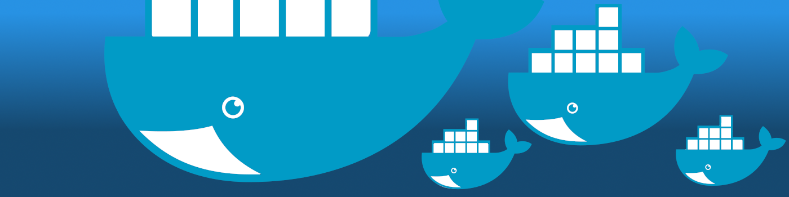
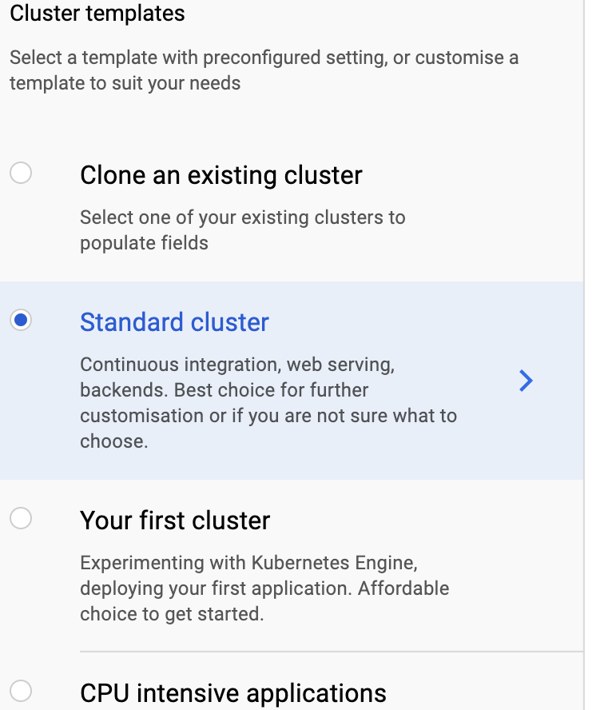
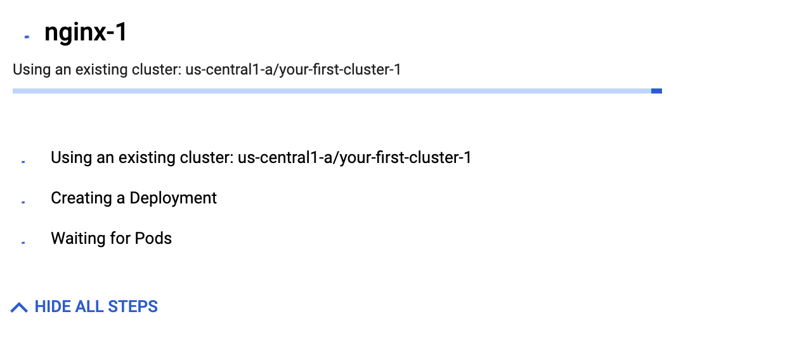
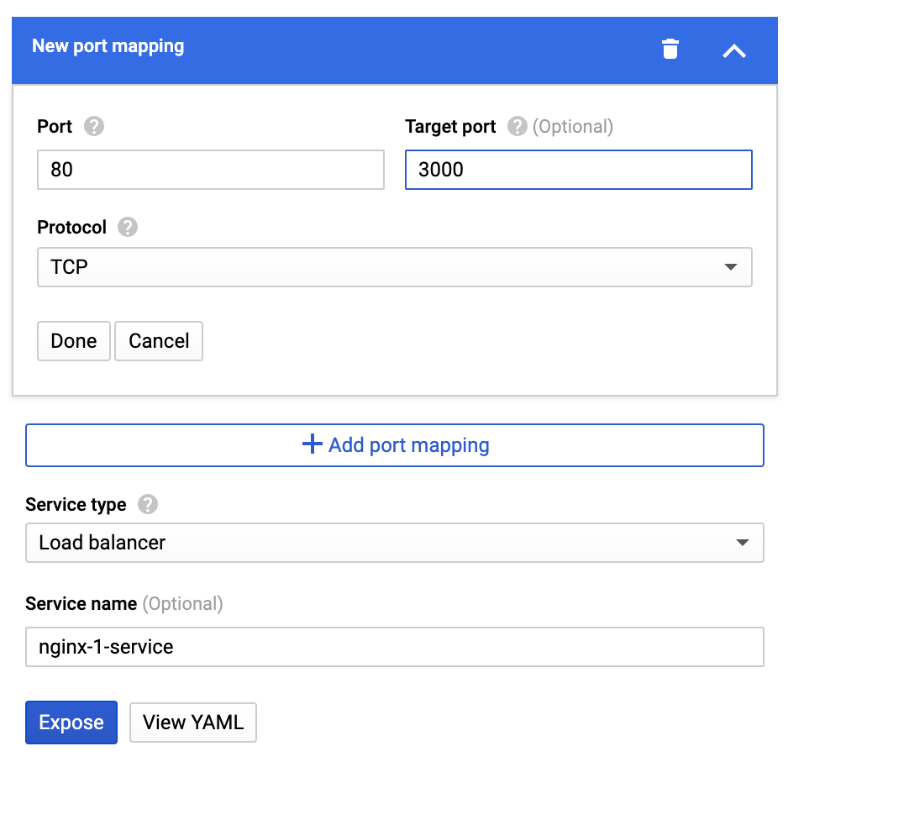

A guide to building a simple pipeline from PR to deploy with a scalable solution. (TurtleWare 2.0 pt3)
<!-- end -->

This is part 3 of a 3 part blog post about making v2 of turtle wear watch face. [You can check out part 1 here](https://ijh.dev/middlewear-go) and [you can check out part 2 here](https://ijh.dev/making-wear-os)

This post will also be covering everything from PR to releasing on a Kubernetes cluster. We will be skipping some of the basics of CI/CD pipelines and what they are, if you are not sure what that is [check out this blog post on a mobile CI/CD here](https://ijh.dev/mobile-ci-cd/). 

###Git, pull requests and pipeline starting point


A theme with this guide will be getting free stuff wherever able, the cool thing about open source projects is there is a lot of options. For a good solid Git repo with a good pull request system and plugins to use all these free tools, [you can’t go wrong with GitHub](https://github.com). [Trunk based development](https://trunkbaseddevelopment.com) for git is still the preferred method for having something easy to admin but fast to release. For setting that kind of environment up on GitHub as well as protecting your open source project, make sure you have the following settings:

####*In options:*

*  In Data services, turn on “Security Alerts” to find out if any third-party libraries have a vulnerability and need you to update
* In Merge button, turn “Allow squash merging” and “Automatically delete head branches” on and the others off. This will keep your Trunk/Master branch readable on what went out and when. This goes hand in hand with good pull request descriptions.

####*In branches:*

* Set your default branch to your Trunk/Master branch
* Create a new branch protection rule for the Trunk/Master

####*Inside the branch protection rule:*

* Turn on “Require pull request reviews before merging” with at least 1 approval needed. This will stop anyone from pushing code right into the master branch and instead need a code review before merging.
* With “Require pull request reviews before merging” the option to turn on “Dismiss stale pull request approval when new commits are pushed” appears. This will help if someone has already had their code reviewed but then adds the dreaded “just one more quick fix” to their PR from being able to merge the code without at least 1 reviewer re-checking the PR. 
* Turn on “Require status checks to pass before merging”. This won’t have much of an effect yet but as we get further down we can come back to this rule and set up plugins to prevent PR’s from being merged before checks are complete.

There are other things you can set up here for to depending on what you need such as Wikis and Social Preview images but you can play around there for whatever suits your project best. 


###SonarCloud


One important thing to add to your pipeline is static code analysis. This doesn't replace the need for other engineers reviewing code, rather it acts as an extra reviewer who is obsessed with code rules. The tool we are going to use in this setup is [SonarCloud](https://sonarcloud.io/) as it’s free for open-source code and easily plugs into GitHub. You can sign up for a SonarCloud account by using your GitHub auth, this way you can point it to your project so it can analyze it in just a couple of steps. You can set the code analyser to fire every time you trigger a build and it will comment on the pull request. It will cover a range of rules from code duplication, vulnerabilities including [OWASP Top 10](https://www.owasp.org/index.php/Category:OWASP_Top_Ten_Project) bugs, and Unit test coverage. Going back to GitHub as well, we can now set the “Require status checks to pass before merging” to require SonarCloud to pass before allowing merging.

###DockerHub


So while there are more feature-rich automated building tools available, if your plan is to containerise your program [using Docker](https://www.docker.com/) then there is a simple automated builder in Docker [called DockerHub](https://hub.docker.com/). Before you sign up for that it’s better if you set up a working docker file for your Go program.

So for Turtle Wear the docker image is quite simple and looks like this:

```yaml
FROM golang:alpine AS builder

RUN apk update && apk add --no-cache git ca-certificates 
&& update-ca-certificates
RUN adduser -D -g '' appuser

WORKDIR $GOPATH/src/turtle-wear-api

COPY . .

RUN go mod download && go mod verify
RUN GOOS=linux GOARCH=amd64 CGO_ENABLED=0 go test -cover ./...
RUN GOOS=linux GOARCH=amd64 CGO_ENABLED=0 
go build -o /go/bin/turtle-wear-api ./cmd/turtle-functions/main.go

FROM scratch
COPY --from=builder /etc/ssl/certs /etc/ssl/certs
COPY --from=builder /etc/passwd /etc/passwd
COPY --from=builder /go/bin/turtle-wear-api /go/bin/turtle-wear-api
USER appuser
ENTRYPOINT ["/go/bin/turtle-wear-api"]
```

Credit to [Nathan Dane](https://github.com/ndane) for showing me his implementation and working with me on modifying it for the project needs.

With Golang you can get your unit tests running right inside the docker image as well. The line “RUN GOOS=linux GOARCH=amd64 CGO_ENABLED=0 go test -cover ./…” is what runs all the unit tests in the app and will fail the build if one doesn’t pass. Also the line “RUN apk update && apk add --no-cache git ca-certificates && update-ca-certificates” was needed otherwise the container couldn’t make external requests.

Once you have a docker file setup and working, [Login to DockerHub](https://hub.docker.com/) and click “Create repository”. Add a name and a description, select public and then connect up your GitHub account and point it to your Golang build with the docker file. From here DockerHub will take the first build and if it’s all working put the image up ready from use. In the same way we did with SonarCloud we can go back to GitHub and set the “Require status checks to pass before merging” to require DockerHub to pass before allowing merging.

###Kubernetes in Google Cloud Platform


“Kubernetes is an open-source system for automating deployment, scaling, and management of containerized applications. It groups containers that make up an application into logical units for easy management and discovery.” Is the business talk way of explaining what they are. In very layman's terms, it’s a way to deploy containers that are self-sustaining, update automatically, and can grow and shrink as demand requires.

There are a few different services to get Kubernetes up and running easily enough, AWS has EKS, Azure has AKS, IBM has… IBM Kubernetes, and Google have GKE. GKE is what we will be using for this guide as it’s the right balance between giving you control and doing things for you. Plus they give you $300 free credit to use in your first year so you can learn the system safely.

To start with, create a new project on the Google Cloud Platform. To do this, first go to the sidebar, click "IAM & admin" then "Manage resources". On this page click Create Project, then in the new project window that appears, enter a project name and other applicable details, then click create.

With that setup, you can now navigate to the Kubernetes Engine in the same left sidebar and click on clusters. Click on create cluster and you should be brought to a new screen with a lot of options. First pay attention to the very left-hand side, here are some templates with descriptions to make choosing the right cluster easier. For the purpose of this guide, we will be using “Your first cluster” as it’s the cheapest and what we are looking for. If you are building something that has higher requirements then feel free to select a different template.



After selecting your template you can move over to the next section to the right. Starting from the top we have Name which is simple enough. deally, remember to name it with “cluster” at the end as you will be naming a few things when setting this up and it’s good to keep a naming convention for clarity later on. Next is Location type, choose zonal unless you really need always-on coverage assurance. Zone or Region just allows you to select where your cluster is hosted. Everything else here is fine as standard for whatever template you’ve chosen, click create when you’re ready. Once that’s done you will be back on the Clusters screen, give your new cluster a few minutes to finish setting up before continuing on.


#####*Not ready yet*

#####*Green tick is good to go*

Next, we need to deploy our container, so click Deploy at the top of the clusters screen. The screen shows Container first, we can take the image path from our DockerHub build, press done then continue. It then moves on to Configuration, here you can name the Application and Namespace, again name them “app” and “namespace” at the end to keep that clarity. At the bottom, it allows you to select your newly created cluster then click Deploy.


#####*More loading times*

This will bring you inside the deployment details page, the next thing to do here is on a prompt near the top of the page which mentions exposing the service. If you click that you will go to another screen where you can map the port for inside the container and the outside world. I highly recommend keeping the port to 80 but using whatever port you have set up inside your code for the target port. Click Expose here and it will start opening up the port.


With that all done you now have an External endpoint IP address. Use this to run tests on your code to make sure in the container is working correctly before moving on.

###DNS Setup


With the IP address from GKE all setup the pipeline is complete, but there is some quality of life things we can do before we call it a full success. Firstly having a raw IP address isn’t the nicest looking way to connect up an endpoint, you can very easily use a web domain you have to be your new endpoint name. If you go to your DNS records for that domain and do the following:

* *Record type* : A
* *Name* : Your domain name but with “api. before it
* *Value* : This is your GKE ip address

If you give it 5-10 mins for the DNS to propagate then give the same tests you were running on the IP address to the name in your DNS record you will find that everything works just the same but looks a lot nicer now.

###Swagger docs


Allowing anyone to understand how your endpoints work and allow them to test them out is a great way to help people on board and save you a lot of time explaining how it works. [Swagger Hub](https://app.swaggerhub.com/) offers a pretty good free hosted setup so long as again it’s open source. The site has an editor and a coding mode so you can set up the page, I would recommend looking at one of their demo pages to understand the layout properly. [You can check out the one I made for Turtle Wear API here](https://app.swaggerhub.com/apis-docs/ijhdev/turtle-wear-api/1.0.0)

###Wrapping up


There you go, you now have a pipeline so when you deploy new code to your Golang project it will check for code issues, run the unit tests, build into a container and then deploy to a scalable solution. This also wraps up the Turtle Wear trilogy of blog posts about my journey of doing a v2 of the app, hopefully it’s of some help to you!


* [Turtle Wear API](https://github.com/seperot/turtle-wear-api)
* [Turtle WearOS App](https://github.com/seperot/turtle-wear)
* [Swagger](https://app.swaggerhub.com/apis-docs/ijhdev/turtle-wear-api/1.0.0)
* [Docker](https://hub.docker.com/r/ijhdev/turtle-wear-api)
